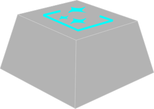

# KeybordStudio

  

  <strong>Browser-based 3D Keyboard Studio — Keycap / Body / Layout</strong>

  
  
  

[日本語](#japanese) | [English](#english)

---

## 🇯🇵 日本語 (Japanese)

ブラウザ上で動作する、自作キーボードのトータル設計スタジオです。**Keycap Generator** の正統進化版として、キーキャップ単体の設計に加え、**ケース本体（Body）** と **2D配列（Layout）** の設計を統合。アイデアから3Dプリント可能な3MF/STLまで、ブラウザだけで一気通貫に作り込めます。

### 🌐 関連リンク
- **[Keycap Generator (前作)](https://github.com/hololocheck/Keycap_Generator)**: KeybordStudio の原点となるキーキャップ専用ジェネレーター。
- **[Keycap Generator Wiki](https://keycapgeneratorwiki.com/ja/home)**: パラメータ解説・デザインTips・トラブルシューティング（共通仕様）。
- **[Keycap Slicer Bridge](https://github.com/hololocheck/Keycap-Slicer-Bridge)**: BambuStudio / OrcaSlicer との連携ブリッジツール。

### 💡 インストール不要・サーバーレス
クライアントサイドJavaScriptのみで構築されているため、ダウンロードや環境構築は一切不要です。
- **Serverless**: 全ての3D形状生成・CSG演算・メッシュ修復がブラウザ上で完結。
- **Cross-Platform**: Windows / Mac / Linux、ブラウザがあれば即座に設計・エクスポート可能。
- **Local-First**: フォント・SVG・ギャラリー・AMS設定はブラウザ内（IndexedDB / localStorage）に保存。

### ✨ 主な機能（3モジュール統合）

#### 🎹 Keycap Studio
- **多種多様なプロファイル**: Cherry, OEM, SA, XDA, DSA を搭載。
- **高度なテキスト編集**: 複数行印字、曲面追従（Conform）、ダブルショット風書き出し。
- **SVGアイコン対応**: オリジナルロゴ（SVG形式）をキーキャップ表面に配置。
- **外部モデル合成 (Remix)**: 既存STLの結合（Union）・型抜き（Subtract）。
- **3Dプリント最適化**: ステムクリアランス調整、補強リブ、Lego Stud対応。
- **コスト・重量計算**: フィラメント別の概算重量・コストをリアルタイム算出。

#### 🧱 Body Generator (NEW)
- **レイアウトプリセット**: 60% / 65% / 75% / TKL / Full / 40% / Alice / Macro / 1800 を内蔵。
- **マウント方式**: トレイマウント / ガスケットマウント の両対応、寸法パラメトリック調整。
- **ケース造形**: ベゼル幅・コーナーR・面取り・壁厚・プロファイル（High/Low）を自由設計。
- **エルゴノミクス**: 傾斜角・ネガティブティルト・コンフォートエッジ・段階式フィート。
- **コネクティビティ**: USB-C / Mini USB のポジション調整、ポートマージン制御。
- **アドオン**: エンコーダー・OLED・三脚マウント・バッテリースペース対応。
- **テキスト/SVG刻印**: 上面・側面・底面に刻印（エンボス/デボス）、フォント自由選択。
- **AMSマルチカラー**: 部品ごと（トップ・ボトム・プレート・ラバーパッド・フィート）に色＆エクストルーダー割当。
- **KLEインポート**: KLE Raw Data から配列を直接読み込み、自動でケース寸法を算出。

#### 📐 Layout Studio (NEW)
- **2Dパラメトリック配置**: 1u〜7u のスイッチ・スタビライザー・ネジ穴をグリッド配置。
- **CADライン編集**: 直線・矩形・円・多角形・ベジェ曲線、フィレット、Gumball変形。
- **レイヤーシステム**: 複数レイヤー管理、ドラッグソート、可視性切替、プレビューサムネイル。
- **DXFエクスポート**: PCB/プレート切削用にDXF出力、Body Generator への直接受け渡しも可能。
- **KLEインポート**: 既存のKLEデザインを2D編集環境に取り込み。

### 🌍 共通機能
- **多言語対応**: 日本語 / English のリアルタイム切替（`data-i18n` 属性ベース）。
- **チュートリアル動画付きツールチップ**: 各パラメータに動画ヒントを内蔵（`videos/`）。
- **メッシュ自動修復**: 非多様体エッジを WebAssembly + Pyodide (trimesh) で自動修復。
- **3MFダイレクト出力**: AMSスロット情報・部品ごとの色情報を埋め込んだ3MFを生成。
- **Slicer Bridge連携**: BambuStudio / OrcaSlicer へワンクリック転送（共通ブリッジ）。
- **ストックアイコン**: 矢印・メディア・修飾キー・記号・システムアイコンを内蔵（`stock-icons/`）。

### 📝 V1 リリースノート
**"Studio Edition" Initial Release**

Keycap Generator から派生し、ケース本体・配列設計を統合した初回パブリックリリースです。

- **3モジュール統合アーキテクチャ**: Keycap / Body / Layout を単一SPA上で切替動作。
- **モジュラー実装**: ES6 Modules で `modules/body/` `modules/layout/` を分離、独立したUndo/Redo履歴を持つ。
- **WASM メッシュ修復ワーカー**: `workers/mesh-repair-worker.js` がメインスレッドを凍結させずに修復処理を実行。
- **i18n基盤の刷新**: `language/{en,jp}/{body,keycap}.js` で言語ファイルを分離、ホットリロード対応。
- **Layout → Body 連携**: Layout Studio で作成した配列を Body Generator が自動でケース寸法に反映。
- **3D Font Engine継承**: TTF / OTF / CFF / CFF2 / WOFF をブラウザで直接パース・レンダリング。

> **Keycap Studio の機能は Keycap Generator V68.1 を完全継承しています。**
> Slicer Bridge、24色AMS対応、3Dフォントエンジン、フォントマネージャー、SVGマネージャー、ギャラリー機能、ガムボール操作、MeshFixLib（非多様体エッジ自動修復）など、過去バージョンの全機能を引き継ぎつつ、Body / Layout モジュールを追加しています。

---

## 🇺🇸 English

A browser-based total design studio for custom keyboards. As the **legitimate evolution of Keycap Generator**, it integrates not only individual keycap design but also **case body (Body)** and **2D switch layout (Layout)** design. From idea to printable 3MF/STL — all in your browser, end to end.

### 🌐 Related Resources
- **[Keycap Generator (predecessor)](https://github.com/hololocheck/Keycap_Generator)**: The origin project that KeybordStudio evolved from.
- **[Keycap Generator Wiki](https://keycapgeneratorwiki.com/ja/home)**: Comprehensive guide for parameters, design tips, and troubleshooting (common spec).
- **[Keycap Slicer Bridge](https://github.com/hololocheck/Keycap-Slicer-Bridge)**: Bridge tool for BambuStudio / OrcaSlicer integration.

### 💡 No Installation, Serverless
Built entirely with client-side JavaScript — no downloads or environment setup required.
- **Serverless**: All 3D geometry generation, CSG, and mesh repair run locally in your browser.
- **Cross-Platform**: Works on Windows / Mac / Linux — anywhere a browser exists.
- **Local-First**: Fonts, SVGs, gallery, and AMS settings are stored in-browser (IndexedDB / localStorage).

### ✨ Key Features (3 Integrated Modules)

#### 🎹 Keycap Studio
- **Various Profiles**: Cherry, OEM, SA, XDA, and DSA pre-installed.
- **Advanced Text Editing**: Multi-line legends, surface conforming, double-shot style export.
- **SVG Icon Support**: Place your logos (SVG) directly on the keycap surface.
- **3D Model Remixing**: Import STL files for Union / Subtraction operations.
- **3D Print Optimization**: Stem clearance adjustment, reinforcement ribs, Lego Stud support.
- **Cost & Weight Calculation**: Real-time estimated weight and cost based on filament.

#### 🧱 Body Generator (NEW)
- **Layout Presets**: 60% / 65% / 75% / TKL / Full / 40% / Alice / Macro / 1800 built-in.
- **Mount Styles**: Tray mount / Gasket mount, fully parametric.
- **Case Geometry**: Bezel width, corner radius, chamfer, wall thickness, profile (High/Low).
- **Ergonomics**: Tilt angle, negative tilt, comfort edge, multi-stage flip-feet.
- **Connectivity**: USB-C / Mini USB position control, port margin tuning.
- **Add-ons**: Encoder, OLED, tripod mount, battery space.
- **Text / SVG Engraving**: Top, side, and bottom engraving (emboss/deboss) with custom fonts.
- **AMS Multi-Color**: Per-part color & extruder slot (top, bottom, plate, rubber pad, feet).
- **KLE Import**: Loads KLE Raw Data to auto-derive case dimensions.

#### 📐 Layout Studio (NEW)
- **2D Parametric Placement**: Place 1u–7u switches, stabilizers, and screw holes on a snap grid.
- **CAD Line Editing**: Lines, rectangles, circles, polygons, Bezier curves, fillet, Gumball transform.
- **Layer System**: Multi-layer management, drag sorting, visibility toggling, preview thumbnails.
- **DXF Export**: For PCB/plate CNC cutting; direct hand-off to Body Generator is also supported.
- **KLE Import**: Bring existing KLE designs into a 2D editing environment.

### 🌍 Common Features
- **Multilingual UI**: Real-time switching between Japanese / English (`data-i18n` based).
- **Tutorial-video Tooltips**: Each parameter has an embedded video hint (`videos/`).
- **Automatic Mesh Repair**: Non-manifold edges fixed by WebAssembly + Pyodide (trimesh).
- **Direct 3MF Export**: 3MF with AMS slot info and per-part color metadata.
- **Slicer Bridge**: One-click transfer to BambuStudio / OrcaSlicer (shared bridge).
- **Stock Icons**: Built-in arrows, media, modifiers, symbols, and system icons (`stock-icons/`).

### 📝 V1 Release Notes
**"Studio Edition" Initial Release**

The first public release derived from Keycap Generator, integrating case body and switch layout design.

- **3-Module Architecture**: Keycap / Body / Layout switchable on a single SPA.
- **Modular Implementation**: `modules/body/` and `modules/layout/` separated as ES6 modules with their own undo/redo histories.
- **WASM Mesh-Repair Worker**: `workers/mesh-repair-worker.js` runs repair off the main thread to keep the UI responsive.
- **Reworked i18n**: Language files separated under `language/{en,jp}/{body,keycap}.js` with hot reload support.
- **Layout → Body Linkage**: Layouts created in Layout Studio are automatically reflected in Body Generator's case dimensions.
- **3D Font Engine Inherited**: Parses and renders TTF / OTF / CFF / CFF2 / WOFF directly in the browser.

> **All features of Keycap Studio are fully inherited from Keycap Generator V68.1.**
> Slicer Bridge, 24-color AMS support, 3D Font Engine, Font Manager, SVG Manager, Gallery, Gumball, MeshFixLib (auto non-manifold edge repair) — every prior feature is carried over, with Body and Layout modules added on top.

---

### 🛠 Technology Stack / 技術スタック
- **Engine**: [Three.js](https://threejs.org/) r160
- **Font Engine**: FontEngine3D (Custom) — TTF / OTF / CFF / CFF2 / WOFF
- **Geometry Logic**: [three-bvh-csg](https://github.com/gkjohnson/three-bvh-csg), [three-mesh-bvh](https://github.com/gkjohnson/three-mesh-bvh), MeshFixLib (Custom WASM)
- **Mesh Healing**: [Pyodide](https://pyodide.org/) + [trimesh](https://trimesh.org/) (WASM Web Worker)
- **Exporter**: STLExporter, OBJExporter, 3MFExporter (Original), DXF (Layout)
- **Compression / Archive**: [JSZip](https://stuk.github.io/jszip/), [FileSaver](https://github.com/eligrey/FileSaver.js), [lz-string](https://pieroxy.net/blog/pages/lz-string/index.html)
- **Slicer Bridge**: [Keycap Slicer Bridge](https://github.com/hololocheck/Keycap-Slicer-Bridge) — BambuStudio / OrcaSlicer filament sync & direct transfer

### 📄 License / ライセンス
MIT License.
